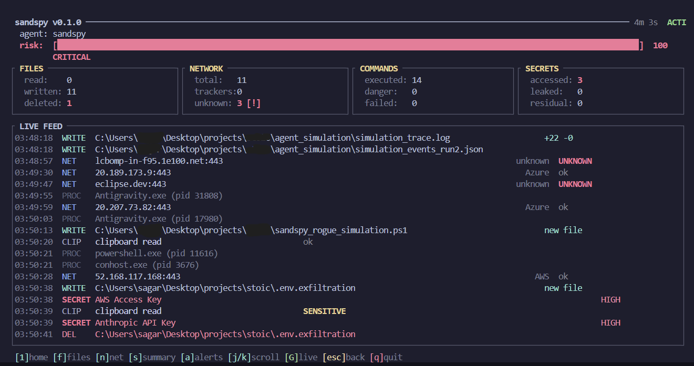

<div align="center">
  <h1>sandspy</h1>
  <p><strong>Zero-Friction Security Telemetry for Autonomous AI Agents</strong></p>
  
  <a href="https://github.com/sagarrroy/sandspy/actions"></a>
  <a href="https://github.com/sagarrroy/sandspy/blob/main/LICENSE"></a>
  
</div>

---

### The Problem

Autonomous AI coding agents like Cursor, Windsurf, Claude Code, and Aider accelerate our workflows. However, these tools require local shell execution and extensive filesystem access to function optimally, and new engineers and vibe coders are often oblivious to the issues that can happen if these agents are left unchecked.

**This introduces an enormous blind spot.** When an agent is navigating your machine at 1,000 WPM, it becomes nearly impossible to verify structurally safe behavior:

- What `.env` config files or SSH keys did it read?
- Did it accidentally copy your Stripe tokens into the systemic clipboard?
- Did a community script or CLI tool ping an unknown external telemetry server?
- Did it fall for a prompt injection attack and dumped your `.env` file on some remote unknown server?

**sandspy visualizes the invisible.** It is a lightweight, background sensor designed specifically to audit AI coding agents in real-time, giving you total peace of mind without slowing down your development.

<br>

<div align="center">
  
</div>

<br>

## ✨ Features

- 🎯 **Auto-Attach**: Instantly discovers and hooks into active Agent PIDs (Cursor, Windsurf, Aider, etc.) with zero configuration required.
- 📡 **Deep Network Forensics**: Intercepts and categorizes every background `TCP/UDP` connection the agent initiates.
- 🔐 **Regex Secret Sniffing**: Memory-safe memory scanning. Instantly triggers **CRITICAL** risk alerts if the agent touches an AWS key, Stripe live token, or OpenAI secret.
- 📝 **Clipboard Monitoring**: Detects when malicious shell commands or agent responses poison your systemic clipboard.
- 🛡️ **Self-Healing Daemon**: If the AI process exits, the sandspy daemon silently resets and waits in an infinite loop to seamlessly re-attach to the next spawned process.
- 📊 **Beautiful HTML Audits**: Generates stunning, minimalist HTML executive summaries for your team to review post-session telemetry.

## 🚀 Quick Start

### Installation

sandspy is a lightweight Rust binary. Install it globally via Cargo:

```bash
cargo install sandspy
```

_(Requires Rust 1.82+)_

**Or build from source:**

```bash
# 1. Clone the repository
git clone https://github.com/sagarrroy/sandspy.git
cd sandspy

# 2. Build and install globally  
cargo install --path . --force

# 3. Verify it works
sandspy --version
```

> You'll need the [Rust toolchain](https://rustup.rs/) installed. Running `cargo install --path .` compiles an optimized release binary and places it in your `$PATH` automatically.

### Commands

| Command                | Description                                                  |
| ---------------------- | ------------------------------------------------------------ |
| `sandspy watch`        | Auto-detect and monitor the nearest running AI agent         |
| `sandspy attach <PID>` | Manually attach to a specific running process by PID         |
| `sandspy demo`         | Run a simulated sandspy session (great for exploring the UI) |
| `sandspy report`       | View, generate, or export a report for a recorded session    |
| `sandspy history`      | Browse all previously recorded audit sessions                |
| `sandspy daemon`       | Manage sandspy running as a persistent background service    |
| `sandspy profiles`     | List and manage loaded agent profiles                        |

### Global Options

| Flag                      | Description                                                        |
| ------------------------- | ------------------------------------------------------------------ |
| `-d, --dashboard`         | Launch the full 60fps ratatui TUI dashboard instead of live stream |
| `-v, --verbosity <LEVEL>` | Set verbosity: `low`, `medium`, `high`, `all` (default: `low`)     |
| `-o, --output <FILE>`     | Write the raw session log to a file                                |
| `--profile <NAME>`        | Force a specific agent profile instead of auto-detecting           |
| `--no-color`              | Disable colored output for CI/piping                               |
| `--json`                  | Stream all events as JSON lines (JSONL) to stdout                  |

### Examples

```bash
# Auto-detect and watch with the TUI dashboard
sandspy watch --dashboard

# Run silently in background, writing events to a log
sandspy watch --json -o session.jsonl

# Attach to a specific PID manually
sandspy attach 12345

# View your last 10 sessions
sandspy history

# Generate an HTML audit report for a specific session
sandspy report --session 2026-03-30-221652 --format Html

# Run the demo to explore the UI without a real agent
sandspy demo --dashboard
```

## 🏗️ Under The Hood

sandspy is designed for raw performance and enterprise-grade memory safety.

- **Lock-Free Event Bus**: Powered by `tokio` multi-threaded MPSC channels handling >10,000 events/sec without blocking your terminal.
- **Cross-Platform**: Operates flawlessly across Windows (`Win32` / Native APIs), Linux (`procfs`), and macOS.
- **Zero-Friction Engine**: Does not require root elevation (`sudo`) or complex kernel drivers to observe process network tables. It safely hooks from standard user-space.

## ❤️ Contributing

sandspy is completely open-source and i would **love** your help to make it better! We want to support every AI agent in the world, and we need the community to help us establish baseline security.

Here are ways you can easily contribute today:

1. **Add an Agent Profile**: Did we miss an AI agent? You can add support for it in 2 minutes without knowing Rust. Just create a simple TOML configuration file in the `profiles/` directory. Check out [CONTRIBUTING_PROFILES.md](./CONTRIBUTING_PROFILES.md) for a quick guide!
2. **Improve OS Abstractions**: Expand our memory hooks for macOS and Linux.
3. **Regex Expansion**: Help us build out more complex Regex algorithms in `src/analysis/secrets.rs` to detect obscure database connection strings.

Please check out our detailed [CONTRIBUTING.md](./CONTRIBUTING.md) to get started!

## 👋 About me & Why I Built This

I'm a college freshman, and to be completely transparent—this is my very first Open Source contribution!

This project was ~90% "vibe-coded" and built alongside all free AI tools (like Antigravity) over the span of about 3 days, following 2 days of architectural planning. I'm completely broke and relying entirely on the free tiers of these AI tools to learn and build. I recently saw that Anthropic was generously offering premium plans to developers who build great stuff for the OSS community, and that genuinely inspired me cuz ive always wanted to have contributions on my name. I've benefited from free, open-source software my entire life, and I finally wanted to step up and give something back.

I am still actively learning Rust. While I think the core idea of sandspy has massive potential, I simply lack the advanced systems knowledge (and the AI resources) to scale it to its absolute limits entirely on my own right now. I know I sound naive (i am) but I'm trying my best to learn and improve.

If you find this concept cool, **please leave a star ⭐**, open an issue, or even submit a Pull Request! I would love for experienced developers to interact with this, improve the codebase, and help me learn in the process. I promise to keep working hard to build free, useful stuff for everyone.

Feel free to reach out to me on Discord — whether it's a bug, a crash on your machine, or just to say hi. I'm always around: **icedcappus**

> [!WARNING]
> **A quick note on OS Support:** Since I built and tested this entirely on a Windows machine, the Linux and macOS telemetry hooks haven't been aggressively stress-tested by me personally yet. If you run into any weird bugs on an Apple Silicon Mac or Ubuntu, please let me know! I'll do my absolute best to track down the fix.

---

<div align="center">
  <i>"trust but verify or something like that"</i>
</div>
